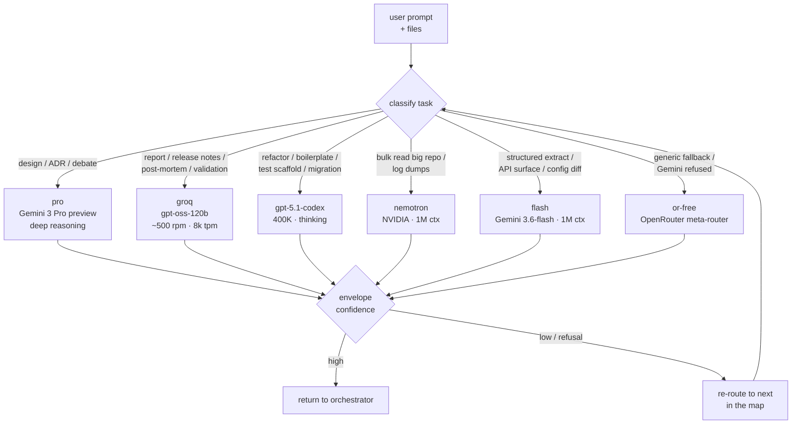
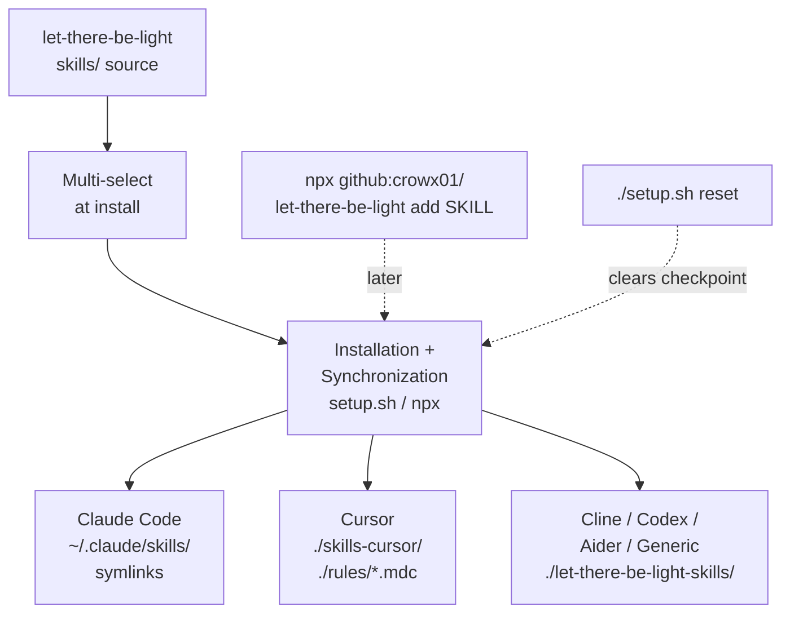

# let-there-be-light

**From design to production. Let there be light.**

> "And God said, Let there be light: and there was light." Genesis 1:3

## What it is

It is a framework of skills that turns your AI orchestrator into a senior engineer covering design, implementation, staging, and production. It installs into Claude Code, Cursor, Cline, Codex CLI, Aider, or generates a portable `SYSTEM_PROMPT.md` when the orchestrator is not one of the five. The wizard walks you through picking the orchestrator, the install scope, the skills, and the PAL models. The higher-tier model makes the architectural decisions while cheaper models handle the busy work.

## The days of creation (skills)

| Skill | Job | Source |
|-------|-----|--------|
| [architect](skills/architect/SKILL.md) | Design phase: system design, ADRs, tech-stack choices. | mine |
| [test-strategist](skills/test-strategist/SKILL.md) | Implementation: test pyramid, coverage plan, fixture strategy. | mine |
| [fix-validator](skills/fix-validator/SKILL.md) | Runs the 4-step fix-validation pipeline before any code fix merges or ships. | mine |
| [ship-checklist](skills/ship-checklist/SKILL.md) | Staging: pre-deploy checklist, rollback plan, smoke tests. | mine |
| [incident-response](skills/incident-response/SKILL.md) | Production: alert triage, blast radius, status update. | mine |
| [retrospective](skills/retrospective/SKILL.md) | Post-incident: timeline, blameless post-mortem, action items. | mine |
| [pal-router](skills/pal-router/SKILL.md) | Delegate-first + failover routing doctrine. | mine |
| [debate-review](skills/debate-review/SKILL.md) | Two-model PR debate, posts one review from your gh/glab/az. | adapted from [amElnagdy/review-skills](https://github.com/amElnagdy/review-skills) (MIT) |
| [babysit-pr](skills/babysit-pr/SKILL.md) | PR review rounds automation: verify, fix, reply, resolve, re-run. | adapted from [amElnagdy/review-skills](https://github.com/amElnagdy/review-skills) (MIT) |

## What stays in your orchestrator (never delegated)

- user-facing engineering decisions
- severity of an incident
- risk vs speed trade-offs
- safety-boundary checks (secrets, destructive migrations, prod actions)
- side-effecting actions (kubectl apply, terraform apply, DB migrations)
- tool-sequence orchestration

## Model routing workflow

The router picks a delegate per task class. High-context / low-tokens paths win by default; the orchestrator's own model is reserved for judgment calls and side effects.



<details><summary>ASCII fallback</summary>

```text
                          user prompt + files
                                   │
                                   ▼
              ┌────────────────────────────────────────┐
              │   classify task                        │
              └───┬─────┬─────┬─────┬─────┬────────────┘
                  │     │     │     │     │
     design/     │  report/│  refactor│  bulk    │  structured   generic /
     ADR/debate  │  release│  boiler- │  read of │  extract      Gemini
                 │  notes / │  plate/  │  large   │  (API /       refused
                 │  validate│  tests/  │  repos/  │  config /
                 │          │  migrate │  logs    │  deps)
                 ▼          ▼          ▼          ▼          ▼          ▼
                pro        groq       gpt-5.1-   nemotron    flash    or-free
              Gemini 3   gpt-oss-      codex     NVIDIA    Gemini 3.6-  OR meta
              Pro pre    120b        400K       1M ctx    flash 1M     router
              (adversary)(500 rpm    (thinking) (bulk     (structured  (fallback)
                         8k tpm)                readonly) extract)
                 │          │          │          │          │          │
                 └──────────┴──────────┴─────┬────┴──────────┴──────────┘
                                             ▼
                                    envelope confidence?
                                     ├── high ──▶ return
                                     └── low / refusal ──▶ re-route
```

</details>

## The 4-phase lifecycle

1. **Design:** architect skill + pro debate → ADR + trade-off matrix.
2. **Implementation:** test-strategist + debate-review → tested code + one PR review.
3. **Staging:** ship-checklist → rollback plan + smoke tests.
4. **Production:** incident-response ready; retrospective for anything customer-visible.

Full spec: [docs/WORKFLOW.md](docs/WORKFLOW.md).

### The 4-step fix-validation pipeline (inner loop)

Every code fix runs through a fixed 4-step pipeline before it merges or ships, mirroring the sauron `validator` pattern but for software fixes rather than vulnerabilities:

1. **Stress-test** the fix with `fix-validator`: 12 fields including Root Cause Confidence, Regression Risk, Blast Radius, Test Coverage, Missing Tests, Rollback Complexity, Side Effects, Security Impact, Performance Impact, Backwards Compatibility, Deployment Risk, Final Verdict.
2. **Gap tests** for every missing test the validator flagged (unit, contract, integration, mutation).
3. **Adversarial code review** via `mcp__pal__challenge` (pro primary, groq fallback). Attacks the fix from correctness, layering, rollback, backwards compat, and 10x-traffic angles.
4. **Synthesize + write** the PR description (delegated to groq); human byte-checks file paths, function signatures, migration steps against the raw diff before merge.

Full spec: [skills/fix-validator/SKILL.md](skills/fix-validator/SKILL.md).

## Orchestrators

The installer supports six targets. Pick one at prompt `0` in `./setup.sh`.

- **Claude Code** (default): writes `~/.claude/settings.json` (or `./.claude/settings.json` for per-project) with `SessionStart` + `UserPromptSubmit` hooks, and symlinks `skills/*` into `~/.claude/skills/`.
- **Cursor**: writes `./.cursor/rules/let-there-be-light.mdc` with `alwaysApply: true`, and copies `skills/*` into `./.cursor/rules/let-there-be-light-skills/` so the model can read them.
- **Cline**: writes `./.clinerules` (or `~/.clinerules` for global) with the routing doctrine, and copies `skills/*` into `./let-there-be-light-skills/`.
- **Codex CLI**: writes `~/.codex/instructions.md` and copies `skills/*` into `~/.codex/let-there-be-light-skills/`.
- **Aider**: writes `./.aider.let-there-be-light.md` (add to your `.aider.conf.yml` as `read: [./.aider.let-there-be-light.md]`) and copies `skills/*` into `./let-there-be-light-skills/`.
- **Generic / other**: writes `./SYSTEM_PROMPT.let-there-be-light.md` you can paste into any tool's system prompt, with `skills/*` copied alongside.

For non-Claude orchestrators the installer also appends an index of the shipped skills to the rules file so the model knows what SKILL.md files it can read when a trigger phrase appears (since only Claude Code has the `Skill()` primitive).

## Failover doctrine

If any model refuses, times out, or errors, immediately re-route. Refusal is a routing problem, not a stop.

## Install

```bash
# One-liner (Node available) — pulls the repo, then runs the installer:
npx --yes github:crowx01/let-there-be-light

# or clone + run bash
git clone https://github.com/crowx01/let-there-be-light && cd let-there-be-light
./setup.sh
```

> Not published to npm yet, so use the `github:` shorthand above (or `npm i -g .`
> from a clone if you want a persistent `let-there-be-light` binary on `PATH`).

`setup.sh` (and its `npx` wrapper) walks you through scope, orchestrator, which
skills auto-load at session start, which PAL models you have keys for, and then
does the rest for you: writes rules/settings, backs up any existing files with a
`.bak.<timestamp>` suffix, installs skills into the right agent-specific dirs,
and clones/registers the PAL MCP server if missing.

**Ctrl+C safe.** State is checkpointed at `$XDG_STATE_HOME/lttbl/install-state`
(default `~/.local/state/lttbl/`). If the installer is interrupted, re-running
picks up at the first incomplete step.

```text
Previous installation detected.

✓ Orchestrator selection
✓ Install scope
✓ Skill preload picks
✓ PAL model picks
→ Rules/settings file
○ CLAUDE.md doctrine
○ Skills installed
○ API keys

Resuming installation…
```

Reset the checkpoint at any time with `./setup.sh reset`.

See a full picture-book walkthrough of the wizard: **[docs/install-walkthrough.pdf](docs/install-walkthrough.pdf)** (6 pages).

Prefer manual? See `settings.example.json` (Claude Code format).

## Skills

**What Skills are.** A skill is a bundle of instructions the AI orchestrator
loads into a conversation when a matching trigger phrase appears (Claude Code
via the `Skill()` primitive; every other orchestrator by referencing the
skill's `SKILL.md` from a rules file). Each skill lives under
[`skills/<name>/`](skills/) and ships a single `SKILL.md` with YAML
frontmatter (`name`, `description`) plus optional `scripts/`, `references/`,
and `assets/` sub-dirs.

**Why they exist.** They let you keep the expensive tokens (design, ADR
writing, PR reviews, incident triage) in one central library that stays
version-controlled, instead of pasting the same paragraphs into every
conversation.

**How the installer handles skills automatically.** After you pick your
orchestrator and scope, the installer:

1. Installs a `SessionStart` hook (Claude Code) or an `alwaysApply` rules
   file (Cursor/Cline/Codex/Aider/generic) that names which skills to
   preload.
2. Copies or symlinks the shipped skills into the correct agent-specific
   directory (see the workflow diagram below).
3. Re-runs are idempotent: existing symlinks are refreshed, and user-added
   siblings are never overwritten.

**Where they go per agent.**

| Agent | Skills destination | Rules destination |
|-------|--------------------|-------------------|
| Claude Code | `~/.claude/skills/` (or `./.claude/skills/` per-project) | `~/.claude/settings.json` |
| Cursor | `./skills-cursor/` | `./rules/let-there-be-light.mdc` |
| Cline | `./let-there-be-light-skills/` | `./.clinerules` |
| Codex CLI | `~/.codex/let-there-be-light-skills/` | `~/.codex/instructions.md` |
| Aider | `./let-there-be-light-skills/` | `./.aider.let-there-be-light.md` |
| Generic | `./let-there-be-light-skills/` | `./SYSTEM_PROMPT.let-there-be-light.md` |

**Add a single skill after install.** No need to re-run the wizard.

```bash
npx --yes github:crowx01/let-there-be-light add caveman   # or: ./setup.sh add caveman
npx --yes github:crowx01/let-there-be-light list          # show what's available
npx --yes github:crowx01/let-there-be-light sync          # re-link every shipped skill
```

**Add your own skill.** Drop a directory under `skills/<your-skill>/` with a
`SKILL.md` (YAML frontmatter + prose body). Re-run `./setup.sh sync` (or
`npx --yes github:crowx01/let-there-be-light sync`) and it becomes available to
every registered agent.

**Update / remove.** Skills are symlinked (Claude Code) or synced with rsync
(other agents) from `skills/`. Delete the source directory and re-run `sync`
to remove; pull upstream and re-run `sync` to update.

### Skills workflow



<details><summary>ASCII fallback (renders where Mermaid is stripped)</summary>

```text
     ┌───────────────────────────┐
     │  let-there-be-light       │
     │  skills/ source           │
     └────────────┬──────────────┘
                  │
                  ▼
     ┌───────────────────────────┐
     │  Multi-select at install  │
     └────────────┬──────────────┘
                  │
                  ▼
     ┌───────────────────────────┐        ┌────────────────────────┐
     │  Installation + Sync      │◀── ─ ─ │ npx github:crowx01/    │
     │  setup.sh  /  npx --yes   │        │ let-there-be-light add │
     └───┬─────────┬──────────┬──┘        └────────────────────────┘
         │         │          │
         ▼         ▼          ▼
   ┌───────────┐ ┌──────────────┐ ┌───────────────────────────────┐
   │ Claude    │ │ Cursor       │ │ Cline / Codex / Aider /       │
   │ ~/.claude │ │ ./skills-    │ │ Generic                       │
   │  /skills/ │ │  cursor/     │ │ ./let-there-be-light-skills/  │
   │ symlinks  │ │ ./rules/*.mdc│ │                               │
   └───────────┘ └──────────────┘ └───────────────────────────────┘
```

</details>

## Sibling: sauron

This repo is the sibling to [crowx01/sauron](https://github.com/crowx01/sauron), the offensive-security framework for bug-bounty and pentest work. Same underlying pattern (orchestrator + PAL delegate-first + interactive setup wizard); different skills.

## Attribution

`skills/debate-review` and `skills/babysit-pr` are adapted from [amElnagdy/review-skills](https://github.com/amElnagdy/review-skills) (MIT, Copyright Ahmed Mohammed). Upstream license is preserved inside each skill dir and in [THIRD_PARTY_LICENSES.md](THIRD_PARTY_LICENSES.md).

## License

MIT for let-there-be-light own code ([LICENSE](LICENSE)). Third-party licenses in [THIRD_PARTY_LICENSES.md](THIRD_PARTY_LICENSES.md).

---

> And there was light.
